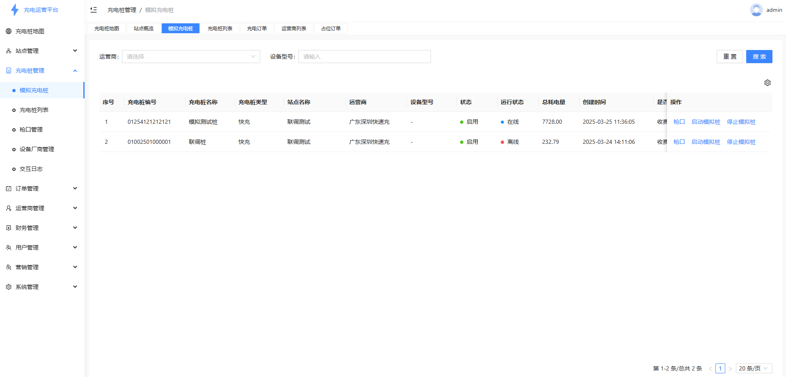
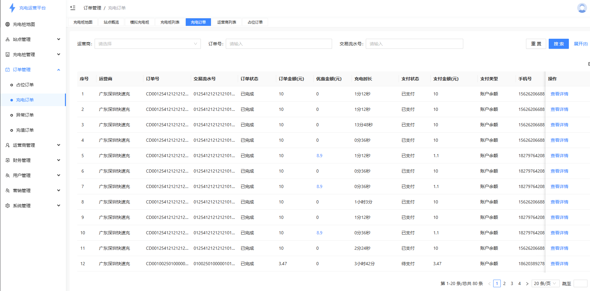

# 充电桩管理平台（完全开源！！！）


现代化的充电桩管理平台，提供充电桩监控、用户管理、支付集成和数据分析等功能，适用于充电桩运营商和电动汽车用户。
### 用心做开源，我们也很需要你的鼓励！右上角Star🌟，等你点亮！
## ✨ 功能特性

### 用户端功能
- **充电桩查找**：地图定位附近可用充电桩
- **扫码充电**：二维码快速启动充电
- **支付集成**：支持在线支付/钱包余额
- **充电历史**：查看历史充电记录和消费明细
- **电子发票**：一键生成电子发票

### 运营商管理
- **设备监控**：实时监控充电桩状态（在线/离线/使用中）
- **故障报警**：设备异常实时通知
- **远程控制**：远程重启/停止充电桩
- **数据分析**：充电量统计、收益报表、用户行为分析
- **多级权限**：分角色管理（管理员/运维/财务）

### 系统特性
- **多协议支持**：OCPP 1.6J/2.0.1 协议兼容
- **多平台适配**：Web + 微信小程序 + Android/iOS APP
- **支付安全**：PCI DSS 合规支付处理
- **高并发处理**：支持10,000+充电桩同时在线
- **智能调度**：基于负载均衡的充电桩分配策略

## 🛠 系统架构图


## 项目目录结构
```
backend/
│
├── cg-api/                      # api服务
│   └── pom.xml                  # Maven 配置文件
│
├── cg-auth/                      # 认证服务
│   └── pom.xml                  # Maven 配置文件
│
├── cg-common/                   # 公共服务
│   └── pom.xml                  # Maven 配置文件
│
├── cg-gateway/                  # API 网关
│   └── pom.xml                  # Maven 配置文件
│
├── cg-modules/                   # 模块服务
│   └── cg-alarm                  # 告警模块
│   └── cg-app                    # 小程序模块
│   └── cg-device                 # 设备模块
│   └── cg-device-data            # 设备数据模块
│   └── cg-file                   # 文件模块
│   └── cg-order                  # 订单模块
│   └── cg-pay                    # 支付模块
│   └── cg-system                 # 系统模块
│   └── cg-device_scale           # 模拟桩模块
│   └── pom.xml                  # Maven 配置文件
│
└── cg-web/                       #前端服务
```
## 📖 UI界面展示





## 📱 系统演示
- 需要地址账号登录请联系我们！！！

### 🖥 运行环境

```
MQ
Netty
JDK1.8
SrpingCloud
MySQL 5.7 ～ 8.0
Redis

```


## 🤝 社区支持
欢迎加入我们的社区，一起打造一个充满charge的充电桩管理平台。
## 📝 许可证
本项目采用 MIT 许可证，详细请参考 LICENSE 文件。
## 联系我们
- 微信：WoaahWoaah
- 

## 🎉 贡献指南
欢迎任何形式的贡献，包括但不限于：
- 报告问题
- 改进代码
- 添加新功能
- 改进文档

## 🙏 致谢


